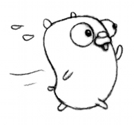

# Gopher Download Manager

Concurrent Download Manager built with Golang without any dependency.

## Usage

To execute the program, you need to run the following command with args:

```bash
$ go run main.go <url> <filename> <threads>
```

As you can see above, you just need to specify the URL of the file you want to download, the filename of the file you want to save, and the number of threads you want to use.

## Example

For example, you can run the following command to download a beautiful gopher image:

```bash
$ go run main.go https://golang.org/doc/gopher/run.png gopher.png 10
```

Then you can see the following image in `data` directory:


